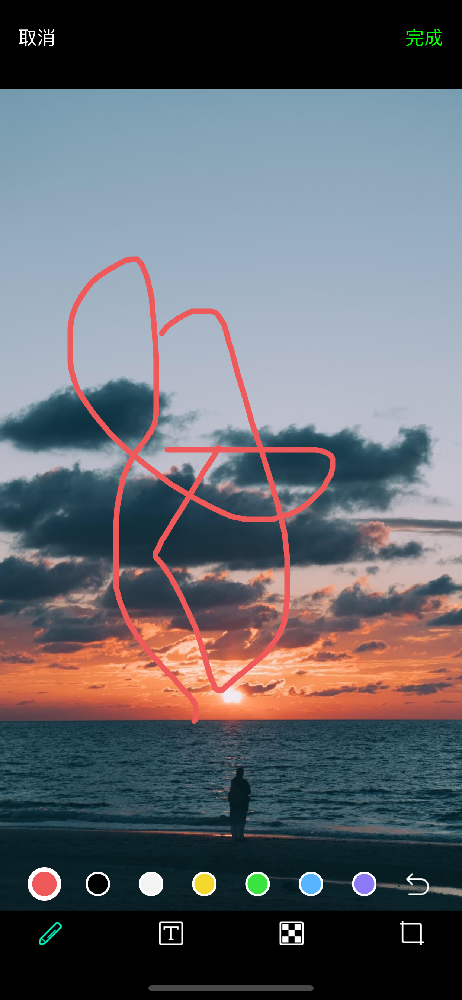
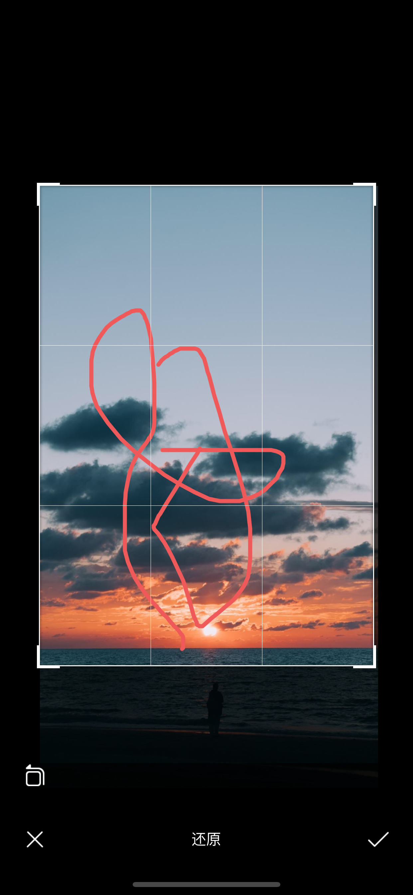
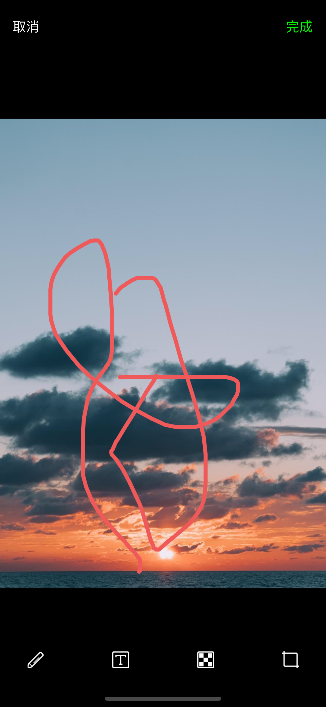
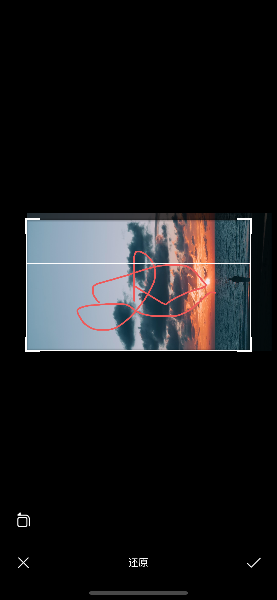
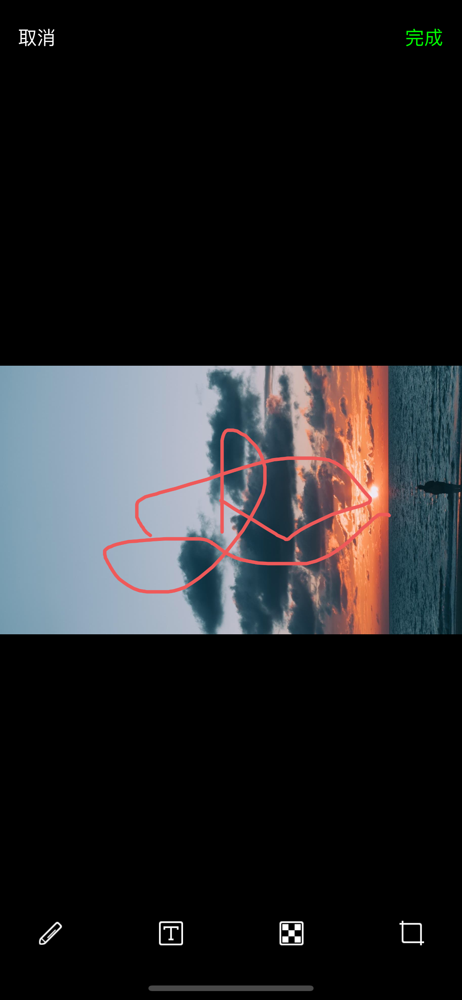
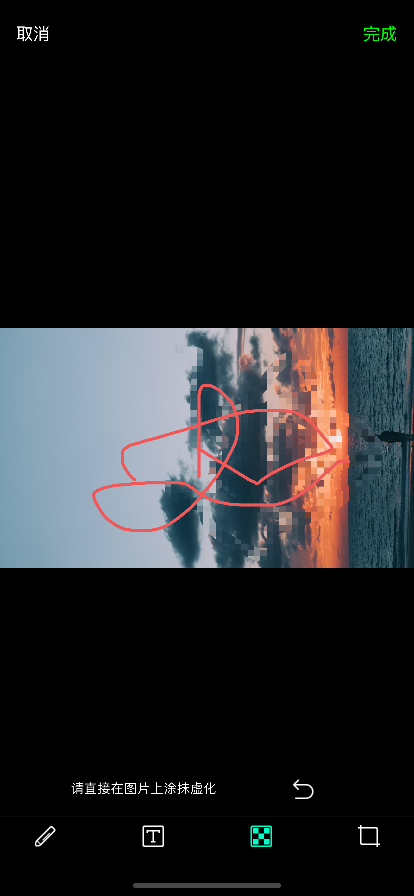
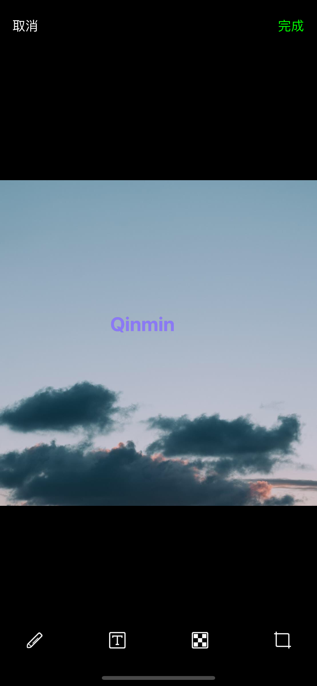

WBGImageEditor 是一个和微信一样图片编辑的组件，功能强大，极易集成，支持绘制、文字、旋转、剪裁、马赛克等功能。

# Base On
- ZMJImageEditor

# Feature
- 1、Draw

- 2、Text

- 3、Mosica

- 4、Crop


# GIF


# ScreenShot











# Usage

调起

```
WBGImageEditor *editor = [[WBGImageEditor alloc] initWithImage:_imageView.image delegate:self];
[self presentViewController:editor animated:YES completion:nil];
```

回调delegate

```
#pragma mark - WBGImageEditorDelegate
- (void)imageEditor:(WBGImageEditor *)editor didFinishEdittingWithImage:(UIImage *)image
{
	self.imageView.image = image;
	[editor.presentingViewController dismissViewControllerAnimated:YES completion:nil];
}

- (void)imageEditorDidCancel:(WBGImageEditor *)editor 
{

}
```

# Requirements
- iOS7+

# Author
- keshiim

- Qinmin

# Blog

- [秦明Qinmin](https://www.jianshu.com/u/fff74d0ebed7)


# Contact Me

- Email: 11gmqin@gmail.com

# License
- WBGImageEditor is available under the MIT license. See the LICENSE file for more info.


